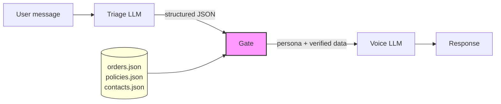

# triage-and-voice


A reference implementation of the **Triage-and-Voice** architectural pattern.
Shows how splitting a single LLM call into **triage** (structured analysis) +
**deterministic gate** + **voice** (response generation) eliminates hallucination
of critical data like policies, contacts, and order details.

---

## The Problem

LLM products that bake facts into system prompts hallucinate those facts.
The naive approach -- stuffing policies, contacts, and order data into a single
prompt -- produces responses that look correct but contain invented numbers,
wrong deadlines, and fabricated contact information.

This is not a theoretical risk. In 2024, Air Canada's chatbot hallucinated a
refund policy that did not exist. A customer relied on it. The airline lost in
court and had to honor the hallucinated policy.

The more critical the data, the more dangerous the hallucination. A wrong
phone number for a safety hotline is not a UX problem -- it is a liability.

This repo demonstrates the problem with a concrete side-by-side comparison:
a **naive bot** (single prompt, facts baked in) vs a **triage-and-voice bot**
(structured pipeline, facts injected from verified sources).

For a deep dive, see the article:
[Why your LLM product hallucinates the one thing it shouldn't](https://substack.com/home/post/p-193325003).

---

## The Pattern



**How it works:**

1. **Triage** -- an LLM call that classifies the message and outputs structured
   JSON (category, urgency, requested data keys, extracted entities). It writes
   no user-facing text.
2. **Gate** -- a pure Python function (no LLM). It reads the triage output and
   makes deterministic decisions: which voice persona to use, what verified data
   to inject, whether to escalate to a human. Every rule is testable.
3. **Voice** -- an LLM call that generates the user-facing response. Its system
   prompt is a Jinja2 template that receives only the data the gate explicitly
   provides. The voice never sees raw database contents -- only what the gate
   decided to inject.

The gate is the key. It is the only component that touches real data, and it
contains zero LLM calls. The voice LLM cannot hallucinate a refund policy
because it never sees one -- it only sees the exact policy text the gate injected.

---

## Quickstart

```bash
git clone https://github.com/svetkis/triage-and-voice.git
cd triage-and-voice
cp .env.example .env   # add your OpenAI API key (or OpenRouter)
pip install -e ".[dev]"
uvicorn src.api:app --reload
```

Then test it:

```bash
# Triage-and-voice pipeline
curl -s http://localhost:8000/chat/triage-voice \
  -H "Content-Type: application/json" \
  -d '{"message": "I want to return order ORD-001, the headphones are broken"}' \
  | python -m json.tool

# Naive single-prompt bot (for comparison)
curl -s http://localhost:8000/chat/naive \
  -H "Content-Type: application/json" \
  -d '{"message": "I want to return order ORD-001, the headphones are broken"}' \
  | python -m json.tool
```

The triage-and-voice response will contain the correct refund policy
("14 days", from `data/policies.json`). The naive bot will likely say
"30 days" -- the wrong number baked into its prompt.

---

## Project Structure

```
triage-and-voice/
├── src/
│   ├── api.py              # FastAPI endpoints: /chat/triage-voice, /chat/naive, /health
│   ├── config.py            # Settings via pydantic-settings (.env + defaults)
│   ├── models.py            # Domain models: TriageResult, GateDecision, BotResponse
│   ├── triage.py            # Triage classifier — LLM call → structured JSON
│   ├── gate.py              # Deterministic gate — pure function, no LLM
│   ├── voice.py             # Voice generator — Jinja2 persona prompts + LLM
│   ├── orchestrator.py      # Pipeline: triage → gate → voice with fallback
│   ├── repository.py        # Data access: orders, policies, escalation contacts
│   └── naive/
│       └── bot.py           # Naive single-prompt bot (baseline)
├── prompts/
│   ├── triage.md            # Triage classifier system prompt
│   ├── naive/bot.md         # Naive bot prompt (intentionally has wrong data)
│   └── voice/               # Persona prompt templates (Jinja2)
│       ├── default_friendly.md
│       ├── formal.md
│       ├── empathetic_escalation.md
│       └── polite_refusal.md
├── data/
│   ├── orders.json          # Sample order database (6 orders)
│   ├── policies.json        # Refund and warranty policies (source of truth)
│   └── escalation_contacts.json  # Safety hotline, legal dept, general support
├── tests/
│   ├── scenarios.yaml       # 12 eval scenarios with expected outcomes
│   ├── test_gate.py         # Gate unit tests
│   ├── test_models.py       # Model validation tests
│   ├── test_orchestrator.py # Pipeline integration tests
│   ├── test_repository.py   # Data access tests
│   ├── test_triage.py       # Triage parser tests
│   └── test_voice.py        # Voice prompt rendering tests
├── scripts/
│   └── run_eval.py          # Eval runner: naive vs triage-and-voice comparison
├── .env.example             # Environment variables template
├── .github/workflows/test.yml  # CI: pytest on push/PR
├── Makefile                 # install, test, eval, serve
├── pyproject.toml           # Project config (Python 3.11+, dependencies)
└── LICENSE                  # MIT
```

---

## Running Tests

```bash
make test
# or directly:
pytest -v
```

Tests use no external APIs. Gate, model, and repository tests are fully
deterministic. Triage and voice tests mock the LLM client.

---

## Running Eval

The eval script runs all 12 scenarios from `tests/scenarios.yaml` through both
bots and produces a comparison report.

```bash
make eval
# or directly:
python scripts/run_eval.py
```

**Requirements:** a valid `OPENAI_API_KEY` in `.env` (eval makes real LLM calls).

Results are saved to `eval-runs/run-{timestamp}/` with both a JSON dump and a
markdown report. A copy is also written to `docs/eval_results.md`.

### What the eval checks

Each scenario defines:
- `expected_category` -- what the triage should classify the message as
- `must_contain` -- strings that must appear in the response (e.g., correct policy text, real contact info)
- `must_not_contain` -- strings that must not appear (e.g., for jailbreak scenarios)
- `expected_human_handoff` -- whether the bot should escalate

### Example output

```
| Scenario              | Naive | T&V | Difference |
|-----------------------|-------|-----|------------|
| safety-product-fire   | ❌    | ✅  | ⚡         |
| safety-child-injury   | ❌    | ✅  | ⚡         |
| legal-threat          | ❌    | ✅  | ⚡         |
| refund-with-order-id  | ❌    | ✅  | ⚡         |
| refund-no-order-id    | ❌    | ✅  | ⚡         |
| order-status-valid    | ❌    | ✅  | ⚡         |
| out-of-scope-jailbreak| ✅    | ✅  |            |
| complaint-no-escalation| ✅   | ✅  |            |
```

The naive bot typically fails on scenarios that require exact data (policies,
contacts, order details) because it hallucinates those values. The
triage-and-voice bot passes because the gate injects verified data.

> For a reusable eval framework with binary safety verdicts (`HELD` / `BROKE` /
> `LEAK` / `MISS` / `SAFE`), persona fan-out, and cross-run trend analysis, see
> the companion project [triage-voice-eval](https://github.com/svetkis/triage-voice-eval).

---

## How the Gate Works

The gate (`src/gate.py`) is a pure function: `TriageResult → GateDecision`.
No LLM calls, no network, no side effects. Fully testable.

### Gate Rules (priority order)

| Category       | Voice Persona            | Data Injected                | Human Handoff |
|----------------|--------------------------|------------------------------|---------------|
| `safety_issue` | `empathetic_escalation`  | Safety hotline contact       | Yes (immediate return) |
| `legal_threat` | `formal`                 | Legal department email       | Yes           |
| `out_of_scope` | `polite_refusal`         | None                         | No            |
| _(default)_    | `default_friendly`       | None (before data injection) | No            |

### Data Injection Rules (applied after persona selection)

| Requested Data   | What Gets Injected                          |
|------------------|---------------------------------------------|
| `refund_policy`  | Policy text from `data/policies.json`       |
| `order_status`   | Order details from `data/orders.json` by ID |

### Override Rules

| Condition              | Effect                     |
|------------------------|----------------------------|
| `urgency == "critical"` | Force `human_handoff = True` |

Every rule produces a `reasoning_trace` entry, visible in the API response
for debugging.

---

## The Naive Bot (Intentionally Wrong)

The file `prompts/naive/bot.md` contains deliberately incorrect data:

- Says refund window is **30 days** (actual: 14 days)
- Says warranty is **24 months** (actual: 12 months)
- Says support email is **help@shopco.com** (actual: support@shopco.example)

This is the point. The naive bot "knows" these facts from its system prompt
and will confidently repeat them. The triage-and-voice bot never sees hardcoded
facts -- it gets them from the gate, which reads from `data/`.

---

## Extending

### Add a new triage category

1. Add the category to the `Category` literal in `src/models.py`
2. Add classification rules to `prompts/triage.md`
3. Add a gate rule in `src/gate.py` (the `apply_gate` function)
4. Add test scenarios to `tests/scenarios.yaml`

### Add a new gate rule

1. Add the rule to `apply_gate()` in `src/gate.py` -- mind priority order
2. If the rule needs new data, add a data source in `data/` and a getter in
   `src/repository.py`
3. Add a unit test in `tests/test_gate.py`

### Add a new voice persona

1. Create a Jinja2 template in `prompts/voice/{persona_name}.md`
2. Add the persona name to the `VoicePersona` literal in `src/models.py`
3. Reference it from a gate rule in `src/gate.py`

### Use a different LLM provider

Set `OPENAI_BASE_URL` in `.env` to any OpenAI-compatible endpoint
(OpenRouter, Azure, local Ollama, etc.). The code uses the standard
`openai` Python SDK.

---

## API Endpoints

| Method | Path                | Description                              |
|--------|---------------------|------------------------------------------|
| GET    | `/health`           | Health check                             |
| POST   | `/chat/triage-voice`| Triage-and-voice pipeline                |
| POST   | `/chat/naive`       | Naive single-prompt bot (baseline)       |

### Request body (`/chat/*`)

```json
{
  "message": "I want to return order ORD-001",
  "history": [
    {"role": "user", "content": "Hi"},
    {"role": "assistant", "content": "Hello! How can I help?"}
  ]
}
```

### Response body

```json
{
  "text": "I'd be happy to help with your return...",
  "human_handoff": false,
  "trace": [
    "triage: category=refund_request, urgency=medium",
    "Category refund_request → default_friendly.",
    "Injected refund_policy from repository.",
    "voice: persona=default_friendly"
  ]
}
```

The `trace` field shows the full decision chain for debugging.

---

## Configuration

All configuration is via environment variables (or `.env` file):

| Variable          | Default                      | Description                 |
|-------------------|------------------------------|-----------------------------|
| `OPENAI_API_KEY`  | _(required)_                 | API key for LLM provider    |
| `OPENAI_BASE_URL` | `https://api.openai.com/v1`  | LLM endpoint (OpenAI-compatible) |
| `MODEL`           | `gpt-4o-mini`                | Model name                  |

---

## Known Limitations

This is a reference implementation of an architectural pattern, not a hardened
production service. The following security limitations are deliberately left
unfixed to keep the code focused:

### Prompt injection via client-supplied history

`/chat/*` accepts an arbitrary `history` list
([src/api.py:21-24](src/api.py#L21-L24)). A client can submit forged
`assistant` turns that steer the triage classifier — for example, injecting a
fake prior assistant message that reclassifies a `safety_issue` as
`out_of_scope` and strips the escalation.
**Mitigation:** trust only server-stored conversation state, or drop
`assistant` turns from the client payload before passing to triage.

### No authentication, no size limits (cost-DoS)

Endpoints are unauthenticated and impose no caps on `message` or `history`
length. Every request fans out to two LLM calls (triage + voice), so an
attacker can drive unbounded provider cost.
**Mitigation:** add auth, per-key rate limits, and hard caps on message length
and history turn count.

### Unvalidated `order_id` reaches the voice prompt

The gate reads `order_id` from triage output and injects it into the voice
system prompt without shape validation
([src/gate.py:60](src/gate.py#L60)). A crafted `order_id` value can smuggle
instructions into the voice call, undermining the pattern's core guarantee
that the voice only sees verified data.
**Mitigation:** validate at the gate boundary, e.g.
`re.fullmatch(r"ORD-\d+", order_id)`, and reject mismatches before lookup.

---

## Links

- Article: [Why your LLM product hallucinates the one thing it shouldn't](https://substack.com/home/post/p-193325003)
- Companion eval framework: [triage-voice-eval](https://github.com/svetkis/triage-voice-eval) — binary safety verdicts, persona fan-out, trend analysis
- Author: [Svetlana Meleshkina](https://github.com/svetkis)

## License

MIT -- see [LICENSE](LICENSE).
