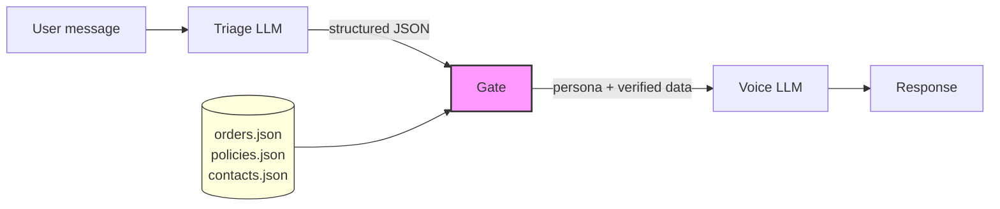

# triage-and-voice


[](https://github.com/svetkis/triage-and-voice/actions/workflows/test.yml)

A reference implementation of the **Triage-and-Voice** architectural pattern.
Shows how splitting a single LLM call into **triage** (structured analysis) +
**deterministic gate** + **voice** (response generation) eliminates hallucination
of critical data like policies, contacts, and order details.

---

## The Problem

LLM products that bake facts into system prompts hallucinate those facts.
The naive approach -- stuffing policies, contacts, and order data into a single
prompt -- produces responses that look correct but contain invented numbers,
wrong deadlines, and fabricated contact information.

This is not a theoretical risk. In 2024, Air Canada's chatbot hallucinated a
refund policy that did not exist. A customer relied on it. The airline lost in
court and had to honor the hallucinated policy.

The more critical the data, the more dangerous the hallucination. A wrong
phone number for a safety hotline is not a UX problem -- it is a liability.

This repo demonstrates the problem with a concrete side-by-side comparison:
a **naive bot** (single prompt, facts baked in) vs a **triage-and-voice bot**
(structured pipeline, facts injected from verified sources).

For a deep dive, see the article:
[Why your LLM product hallucinates the one thing it shouldn't](https://substack.com/home/post/p-193325003).

---

## The Pattern



**How it works:**

1. **Triage** -- an LLM call that classifies the message and outputs structured
   JSON (category, urgency, requested data keys, extracted entities). It writes
   no user-facing text.
2. **Gate** -- a pure Python function (no LLM). It reads the triage output and
   makes deterministic decisions: which voice persona to use, what verified data
   to inject, whether to escalate to a human. Every rule is testable.
3. **Voice** -- an LLM call that generates the user-facing response. Its system
   prompt is a Jinja2 template that receives only the data the gate explicitly
   provides. The voice never sees raw database contents -- only what the gate
   decided to inject.

The gate is the key. It is the only component that touches real data, and it
contains zero LLM calls. The voice LLM cannot hallucinate a refund policy
because it never sees one -- it only sees the exact policy text the gate injected.

---

## Quickstart

```bash
git clone https://github.com/svetkis/triage-and-voice.git
cd triage-and-voice
cp .env.example .env   # add your OpenAI API key (or OpenRouter)
pip install -e ".[dev]"
uvicorn src.api:app --reload
```

Then test it:

```bash
# Triage-and-voice pipeline
curl -s http://localhost:8000/chat/triage-voice \
  -H "Content-Type: application/json" \
  -d '{"message": "I want to return order ORD-001, the headphones are broken"}' \
  | python -m json.tool

# Naive single-prompt bot (for comparison)
curl -s http://localhost:8000/chat/naive \
  -H "Content-Type: application/json" \
  -d '{"message": "I want to return order ORD-001, the headphones are broken"}' \
  | python -m json.tool
```

The triage-and-voice response will contain the correct refund policy
("14 days", from `data/policies.json`). The naive bot will likely say
"30 days" -- the wrong number baked into its prompt.

---

## Project Structure

```
triage-and-voice/
├── src/
│   ├── api.py              # FastAPI endpoints
│   ├── config.py           # Settings via pydantic-settings (.env + defaults)
│   ├── models.py           # Domain models: TriageResult, ExtractedEntities, ChatMessage, BotResponse
│   ├── triage.py           # Triage classifier — LLM call → structured JSON
│   ├── gate/               # Gate framework — reusable, domain-neutral
│   │   ├── __init__.py     #   Public API: Gate, GateAction, DataSource, GateDecision
│   │   ├── contracts.py    #   GateAction and DataSource Protocols
│   │   ├── config.py       #   Pydantic schema + YAML loader
│   │   ├── decision.py     #   GateDecision accumulator + VoiceCallSpec
│   │   ├── engine.py       #   Gate class — dispatch, registries, freeze()
│   │   └── actions/        #   Three built-in action types
│   │       ├── handoff.py
│   │       ├── inject_data.py
│   │       └── voice_response.py
│   ├── voice.py            # Voice generator — Jinja2 persona prompt + LLM
│   ├── orchestrator.py     # Pipeline: triage → gate → voice with fallback
│   └── naive/
│       └── bot.py          # Naive single-prompt bot (baseline)
├── examples/
│   └── shopco/             # Worked example — support bot using the framework
│       ├── main.py         #   build_gate() — registers sources, freezes, returns Gate
│       ├── sources.py      #   OrderSource, PolicySource, ContactsSource
│       ├── config/
│       │   └── shopco.yaml #   Declarative gate config
│       └── tests/
│           ├── test_sources.py       # Data source unit tests
│           └── test_shopco_flow.py   # Acceptance tests against the full config
├── prompts/
│   ├── triage.md
│   ├── naive/bot.md
│   └── voice/              # Persona prompt templates (referenced from shopco.yaml)
│       ├── default_friendly.md
│       ├── formal.md
│       ├── empathetic_escalation.md
│       └── polite_refusal.md
├── data/                   # ShopCo example data (consumed by examples/shopco/sources.py)
│   ├── orders.json
│   ├── policies.json
│   └── escalation_contacts.json
├── tests/                  # Framework tests (engine, actions, config — no ShopCo)
│   ├── gate/
│   │   ├── fixtures/*.yaml
│   │   ├── test_decision.py
│   │   ├── test_config.py
│   │   ├── test_config_loader.py
│   │   ├── test_engine_construction.py
│   │   ├── test_engine_decide.py
│   │   ├── test_engine_freeze.py
│   │   └── actions/
│   │       ├── test_handoff.py
│   │       ├── test_inject_data.py
│   │       └── test_voice_response.py
│   ├── test_models.py
│   ├── test_orchestrator.py
│   ├── test_triage.py
│   └── test_voice.py
├── scripts/run_eval.py
├── .env.example
├── .github/workflows/test.yml
├── Makefile
├── pyproject.toml
└── LICENSE
```

---

## Running Tests

```bash
make test
# or directly:
pytest -v
```

Tests use no external APIs. Gate, model, and repository tests are fully
deterministic. Triage and voice tests mock the LLM client.

---

## Running Eval

The eval script runs all 12 scenarios from `tests/scenarios.yaml` through both
bots and produces a comparison report.

```bash
make eval
# or directly:
python scripts/run_eval.py
```

**Requirements:** a valid `OPENAI_API_KEY` in `.env` (eval makes real LLM calls).

Results are saved to `eval-runs/run-{timestamp}/` with both a JSON dump and a
markdown report. A copy is also written to `docs/eval_results.md`.

### What the eval checks

Each scenario defines:
- `expected_category` -- what the triage should classify the message as
- `must_contain` -- strings that must appear in the response (e.g., correct policy text, real contact info)
- `must_not_contain` -- strings that must not appear (e.g., for jailbreak scenarios)
- `expected_human_handoff` -- whether the bot should escalate

### Example output

```
| Scenario              | Naive | T&V | Difference |
|-----------------------|-------|-----|------------|
| safety-product-fire   | ❌    | ✅  | ⚡         |
| safety-child-injury   | ❌    | ✅  | ⚡         |
| legal-threat          | ❌    | ✅  | ⚡         |
| refund-with-order-id  | ❌    | ✅  | ⚡         |
| refund-no-order-id    | ❌    | ✅  | ⚡         |
| order-status-valid    | ❌    | ✅  | ⚡         |
| out-of-scope-jailbreak| ✅    | ✅  |            |
| complaint-no-escalation| ✅   | ✅  |            |
```

The naive bot typically fails on scenarios that require exact data (policies,
contacts, order details) because it hallucinates those values. The
triage-and-voice bot passes because the gate injects verified data.

> For a reusable eval framework with binary safety verdicts (`HELD` / `BROKE` /
> `LEAK` / `MISS` / `SAFE`), persona fan-out, and cross-run trend analysis, see
> the companion project [triage-voice-eval](https://github.com/svetkis/triage-voice-eval).

---

## The Framework

The gate is not a single file — it's a small reusable framework. One consumer
declares their behaviour in YAML and registers data sources in Python; the
engine does the rest.

### Three built-in action types

After triage, the gate dispatches a list of actions per category. Three types
ship in the core:

| Action             | What it does                                              |
|--------------------|-----------------------------------------------------------|
| `handoff`          | Sets the "escalate to human" flag with a reason           |
| `inject_data`      | Pulls a value from a registered source into the payload   |
| `voice_response`   | Declares the LLM should be invoked with a specific persona and payload keys |

Anything else — returning a document, fetching a price list, posting to Slack —
is a custom action type the consumer registers:

```python
from src.gate import Gate, GateAction

class NotifySlackAction:
    def apply(self, triage, decision, params):
        ...

gate.register_action("notify_slack", NotifySlackAction())
```

### Data sources are consumer-owned

The framework does not know about orders, policies, or contacts. The consumer
defines `DataSource` implementations and registers them by name:

```python
gate.register_source("orders", OrderSource())
gate.register_source("policies", PolicySource())
```

YAML then references these source names in `inject_data` actions.

### YAML is the single declarative artefact

A consumer's entire gate behaviour fits in one YAML file. Example from
[`examples/shopco/config/shopco.yaml`](examples/shopco/config/shopco.yaml):

```yaml
categories:
  safety_issue:
    actions:
      - type: handoff
        params: {reason: safety_incident}
      - type: inject_data
        params:
          source: escalation_contacts
          key: safety_hotline
          contact_key: safety_hotline
      - type: voice_response
        params:
          persona: empathetic_escalation
          inject_data: [safety_hotline]
```

### Startup validation

`Gate.freeze()` walks the full config and fails loud on unknown action types,
unknown persona references, or unknown source references. Called automatically
on the first `decide()` if the consumer didn't call it explicitly. Typos in
YAML fail at startup, not at the first live request.

### The worked example

[`examples/shopco/`](examples/shopco/) is the full reference implementation —
the support-bot scenarios used throughout this README. Read it alongside this
doc; the YAML there is the concrete form of the pattern.

---

## The Naive Bot (Intentionally Wrong)

The file `prompts/naive/bot.md` contains deliberately incorrect data:

- Says refund window is **30 days** (actual: 14 days)
- Says warranty is **24 months** (actual: 12 months)
- Says support email is **help@shopco.com** (actual: support@shopco.example)

This is the point. The naive bot "knows" these facts from its system prompt
and will confidently repeat them. The triage-and-voice bot never sees hardcoded
facts -- it gets them from the gate, which reads from `data/`.

---

## Extending

All extension points live in YAML and in the consumer package. Core framework
code in `src/gate/` is not edited.

### Add a new triage category

1. Add the category to the triage prompt (`prompts/triage.md`) so the classifier returns it.
2. Add the category to the consumer YAML (e.g. `examples/shopco/config/shopco.yaml`) under `categories:` with the desired action list.
3. Add scenarios to `tests/scenarios.yaml` for eval.

### Add a new data source

1. Write a class in your consumer package (e.g. `examples/shopco/sources.py`) implementing `fetch(params: dict) -> str | None`.
2. Register it in your `build_gate()` factory: `gate.register_source("my_source", MySource())`.
3. Reference it from YAML under `inject_data` actions.

### Add a new action type

1. Write a class implementing `apply(triage, decision, params) -> None`.
2. Register it: `gate.register_action("my_action", MyAction())`.
3. Use it in YAML under any category's action list.

### Add a new voice persona

1. Create a Jinja2 template at `prompts/voice/{persona_name}.md`.
2. Add the persona name → template path mapping in YAML under `personas:`.
3. Reference it from any `voice_response` action's `persona` param.

Persona names are arbitrary strings — the framework does not maintain a closed enum.

### Use a different LLM provider

Set `OPENAI_BASE_URL` in `.env` to any OpenAI-compatible endpoint
(OpenRouter, Azure, local Ollama, etc.).

---

## API Endpoints

| Method | Path                | Description                              |
|--------|---------------------|------------------------------------------|
| GET    | `/health`           | Health check                             |
| POST   | `/chat/triage-voice`| Triage-and-voice pipeline                |
| POST   | `/chat/naive`       | Naive single-prompt bot (baseline)       |

### Request body (`/chat/*`)

```json
{
  "message": "I want to return order ORD-001",
  "history": [
    {"role": "user", "content": "Hi"},
    {"role": "assistant", "content": "Hello! How can I help?"}
  ]
}
```

### Response body

```json
{
  "text": "I'd be happy to help with your return...",
  "human_handoff": false,
  "trace": [
    "triage: category=refund_request, urgency=medium",
    "Category refund_request → default_friendly.",
    "Injected refund_policy from repository.",
    "voice: persona=default_friendly"
  ]
}
```

The `trace` field shows the full decision chain for debugging.

---

## Configuration

All configuration is via environment variables (or `.env` file):

| Variable          | Default                      | Description                 |
|-------------------|------------------------------|-----------------------------|
| `OPENAI_API_KEY`  | _(required)_                 | API key for LLM provider    |
| `OPENAI_BASE_URL` | `https://api.openai.com/v1`  | LLM endpoint (OpenAI-compatible) |
| `MODEL`           | `gpt-4o-mini`                | Model name                  |

---

## Known Limitations

This is a reference implementation of an architectural pattern, not a hardened
production service. The following security limitations are deliberately left
unfixed to keep the code focused:

### Prompt injection via client-supplied history

`/chat/*` accepts an arbitrary `history` list
([src/api.py:21-24](src/api.py#L21-L24)). A client can submit forged
`assistant` turns that steer the triage classifier — for example, injecting a
fake prior assistant message that reclassifies a `safety_issue` as
`out_of_scope` and strips the escalation.
**Mitigation:** trust only server-stored conversation state, or drop
`assistant` turns from the client payload before passing to triage.

### No authentication, no size limits (cost-DoS)

Endpoints are unauthenticated and impose no caps on `message` or `history`
length. Every request fans out to two LLM calls (triage + voice), so an
attacker can drive unbounded provider cost.
**Mitigation:** add auth, per-key rate limits, and hard caps on message length
and history turn count.

---

## Links

- Article: [Why your LLM product hallucinates the one thing it shouldn't](https://substack.com/home/post/p-193325003)
- Companion eval framework: [triage-voice-eval](https://github.com/svetkis/triage-voice-eval) — binary safety verdicts, persona fan-out, trend analysis
- Author: [Svetlana Dudinova](https://github.com/svetkis)

## License

MIT -- see [LICENSE](LICENSE).
